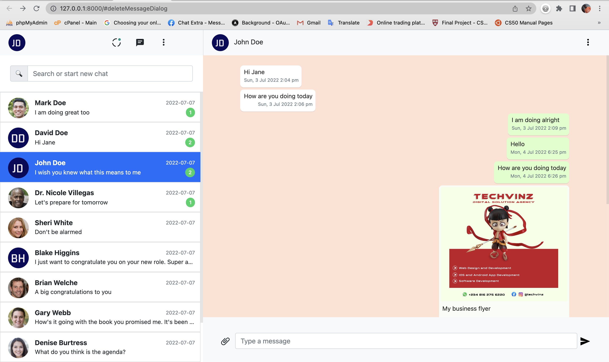

# chat-and-messenger-with-python-flask
===================

### A simple chat and messenger app written with flask - python

## Prerequisite
Make sure you have installed python :) 
To check python version,  
> python -V  

Make sure you have installed 
> python-pip 

* Clone the repository

        git clone https://github.com/VinzTeched/chat-and-messenger-web-app.git   
        cd chat-and-messenger-with-python-flask

* Install dependencies, (use sudo if required)    

        pip install -r requirements.txt 
           
        or 
          
        pip install Flask Flask-Session Flask-SQLAlchemy faker PIL gevent flask_socketio gevent-websocket

* Setup sqlite database or anyother database

        flask shell

        from models import create_random_data
        
        create_random_data()

        quit()
        
* start gevent server 

        gunicorn -k geventwebsocket.gunicorn.workers.GeventWebSocketWorker -w 1 app:app

* start development server or eventlet -- needs it's configurations

        python app.py

* Open it at

        http://127.0.0.1:8000/

* A view of the web app

  
